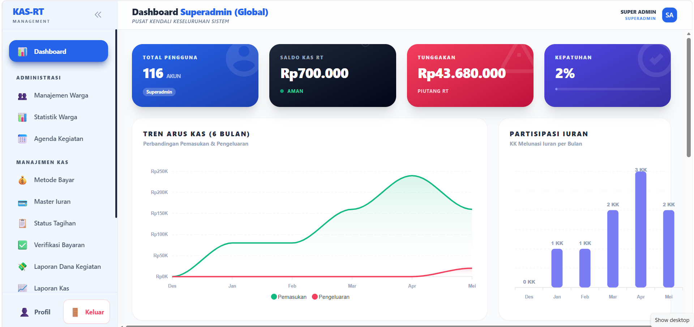
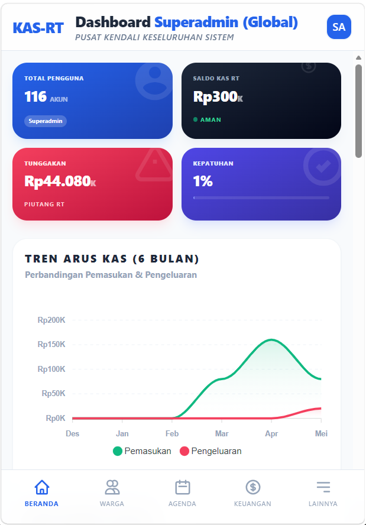
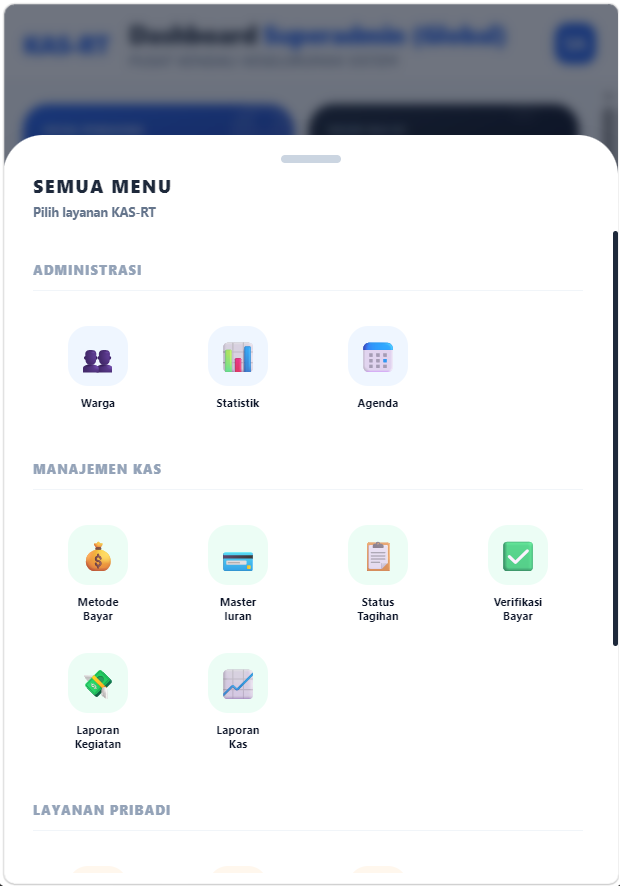

# KAS-RT Digital Management System 🚀
Aplikasi Manajemen Lingkungan Terpadu (Iuran & Kegiatan Warga)

## 📋 Deskripsi Proyek
**KAS-RT Digital** adalah platform ekosistem warga yang mendigitalisasi pengelolaan iuran lingkungan, transparansi dana RT, dan penjadwalan agenda lingkungan. Sistem ini dirancang khusus dengan mengutamakan kenyamanan interaksi pengguna (*mobile-first*), otomasi administratif, dan transparansi keuangan agar tercipta rukun tetangga yang modern dan harmonis.

---

## 🖼️ Tampilan Antarmuka (UI)

  

  
  

---

## 🛠️ Tech Stack
* **Framework:** Laravel (PHP 8.2+)
* **Frontend UI:** Tailwind CSS, Alpine.js
* **Interactive Components:** SweetAlert2 (Notifikasi UI)
* **Database:** MySQL
* **Charts:** ApexCharts (Visualisasi Laporan Kas)
* **Icons:** SVG Native / Heroicons

---

## 👥 Arsitektur Peran Pengguna (User Roles)

Sistem ini memiliki 4 level hak akses (*Role*) yang diisolasi dengan cermat:

| Role | Akses Utama & Tanggung Jawab |
| :--- | :--- |
| **Superadmin** | Kontrol penuh atas seluruh modul, konfigurasi sistem utama, dan bypass fitur. |
| **Ketua RT** | Manajemen profil warga, pemantauan status laporan kas, evaluasi agenda kegiatan warga secara global, dan akses cetak detail profil keluarga warga. |
| **Bendahara RT** | Kontrol penuh arus kas: Manajemen Master Iuran, Verifikasi Bukti Pembayaran, monitoring Status Tagihan, dan satu-satunya yang berhak menekan tombol *"Nagih (WhatsApp)"*. |
| **Warga** | Memperbarui biodata pribadi & sub-KK, melihat agenda RT, mengecek tagihan bulanan secara mandiri, dan mengunggah bukti bayar iuran. |

---

## 🚀 Fitur & Modul Utama (Current State)

### 1. Manajemen Warga & Keluarga (Portal Pribadi)
* **Manajemen 1 Pintu:** Pendaftaran warga baru oleh Admin, lengkap dengan *Unique Constraint* mencegah nomor rumah/blok kembar.
* **Detail Keluarga Komprehensif:** Data penanggung jawab KK, anggota keluarga inti, hingga kerabat yang menumpang (*Sub-KK*) beserta kontak WhatsApp.
* **Fitur Cetak Dokumen (Admin):** Kemampuan pengurus RT untuk melihat jendela modal "Detail Warga" (Read-Only) dan mencetak/print profil riwayat KK warga secara utuh.

### 2. Ekosistem Keuangan & Iuran
* **Master Iuran Dinamis:** Pengurus dapat menentukan jenis iuran dan besaran nominal yang aktif untuk ditagihkan.
* **Otomasi Tagihan Bulanan (Cron Job):** Sistem dibekali scheduler otomatis yang akan men-generate tagihan untuk seluruh warga pada **tanggal 10 setiap bulannya** apabila pengurus lupa melakukannya secara manual.
* **Proteksi Masa Depan (Portal Blocker):** Validasi *backend* mencegah pengurus secara tidak sengaja menerbitkan tagihan untuk bulan/tahun yang belum berjalan.
* **Verifikasi Bukti Transfer:** Warga mengunggah struk bayar $\rightarrow$ Status berubah *Pending* $\rightarrow$ Bendahara menyetujui $\rightarrow$ Lunas.

### 3. WhatsApp Integration (Nagih)
* Fitur eksklusif bagi **Bendahara** untuk mengirim pesan penagihan langsung ke WhatsApp penanggung jawab rumah.
* Pesan secara otomatis dikonstruksi menyertakan detail jumlah bulan menunggak, total nominal tagihan berjalan, dan tautan pintar (Smart Link) ke sistem Kas-RT.

### 4. Agenda Kegiatan & Transparansi Pengeluaran
* **Agenda Manager:** Pencatatan jadwal kegiatan (Kerja bakti, arisan, rapat).
* **Global Alert Interaktif:** Jika tanggal agenda telah terlewati (Expired), sistem akan memunculkan *Global Popup Alert* yang memaksa Pengurus untuk segera menentukan status agenda tersebut (Laksanakan, Tunda/Reschedule, atau Batalkan).
* **Realisasi Anggaran:** Agenda yang telah selesai otomatis terintegrasi ke modul Laporan Pengeluaran (Expenditures) untuk bukti nota transparansi kas keluar.

---

## 📱 Filosofi Desain: Mobile-First DNA (Nyaman di HP)
KAS-RT Digital dirancang dari awal untuk memberikan pengalaman layaknya sebuah *Mobile App*:

* **Bottom Navigation Sheet:** Menu navigasi tidak lagi terselip di tombol hamburger jadul, melainkan menggunakan bilah bawah (*Bottom Bar*) interaktif lengkap dengan sistem *Bottom Sheet* geser ke atas (Grup Layanan Warga & Akun) khusus di tampilan HP.
* **Desktop vs Mobile Switcher:** Sidebar kiri interaktif di versi Desktop, otomatis memudar menjadi UI ringkas di versi Mobile tanpa hambatan visual.
* **DNA *Accordion* (Kartu Lipat Cerdas)**: Data kompleks disulap menjadi wujud "Kartu". Cukup disentuh, kartu melipat terbuka menyajikan detail (anti-sumpek).
* **DNA *Timeline Ledger***: Riwayat 12 bulan ditata menyerupai garis waktu riwayat transaksi perbankan kelas atas.
* **SweetAlert2 Integration:** Dialog box elegan (bukan *alert()* bawaan browser kaku) untuk kenyamanan konfirmasi (Peringatan WA Kosong, Notifikasi Berhasil).

---

## 🗄️ Skema Database Utama
* `users`: Autentikasi, Role, Biodata Warga, Blok & No Rumah.
* `family_members`: Profil Anggota Keluarga & relasi kelompok KK.
* `iuran_masters`: Referensi master besaran tarif iuran aktif.
* `billings`: Catatan invoice/tagihan bulanan tiap warga & validasi bayar.
* `agendas`: Kalender/Jadwal kegiatan lingkungan.
* `expenditures`: Pencatatan pengeluaran uang kas RT.
* `payment_settings`: Rekening penampung dan setup Barcode QRIS.

---
**Developed with ❤️ for a Better Community.**